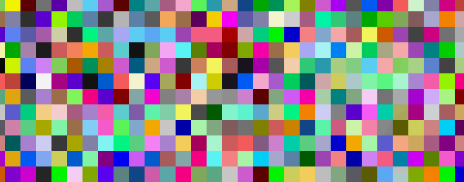
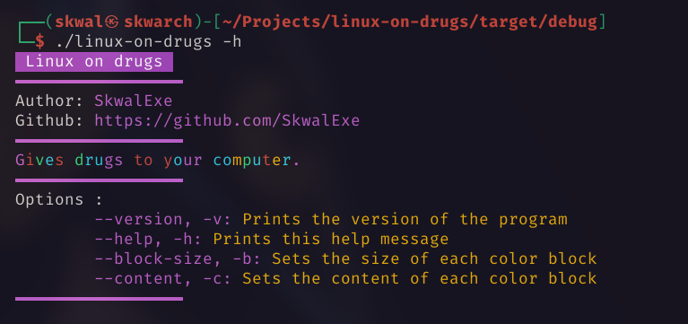
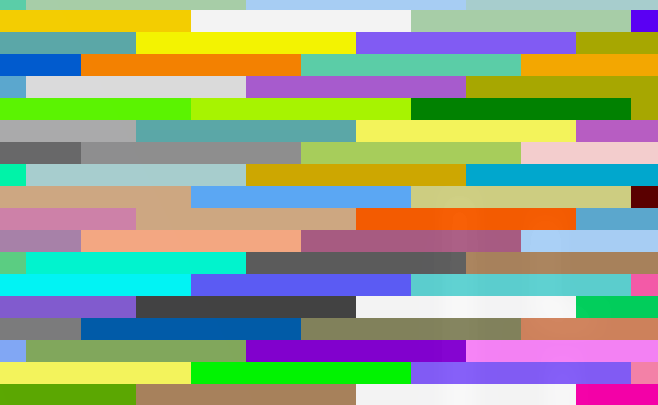

# Linux on drugs🧪



Gives custom drugs to your terminal 💊

Output random colors really fast

# Installation 📦

## Arch Linux

Linux on drugs is in the AUR

```bash
yay -S linux-on-drugs
```

## Other distributions

**Clone this repo**

```bash
git clone https://github.com/SkwalExe/linux-on-drugs.git
```

build with [cargo](https://doc.rust-lang.org/cargo/getting-started/installation.html)

```bash
# 📂 linux-on-drugs/
cargo build --release
```

Move the binary

```bash
# 📂 linux-on-drugs/
sudo cp target/release/linux-on-drugs /usr/bin/linux-on-drugs
```

# Usage 📝



## Example 

```bash
linux-on-drugs --block-size 20
``` 



# How it works 🔬

Very simple, the program select a color number from 1 to 255 and print a space with this background color.

# Uninstall 🗑

Just remove the binary

```bash
sudo rm /usr/bin/linux-on-drugs
```

# final

If you have any problem, don't hesitate to open an issue

# contributing

Pull requests are welcome. For major changes, please open an issue first to discuss what you would like to change.

<a href="https://github.com/SkwalExe#ukraine"></a>